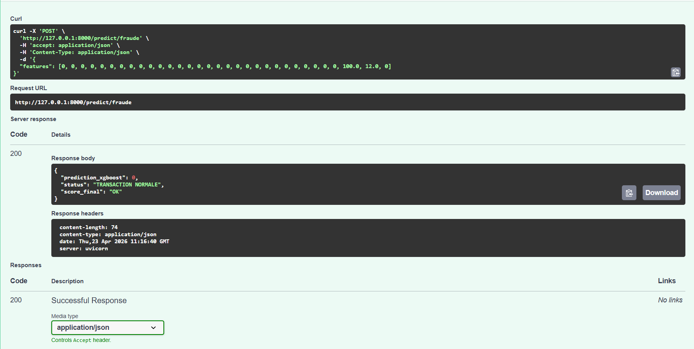
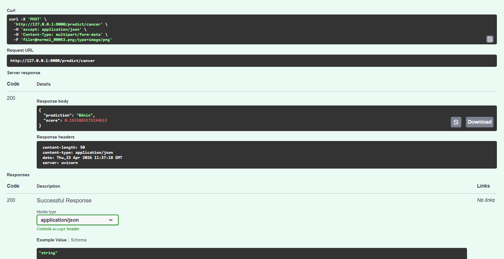

## 🤖 AI Portfolio API : Cancer Detection & Fraud Prediction

Bienvenue dans mon projet de Data Engineering et Machine Learning. Cette API centralise deux modèles d'IA distincts, permettant de traiter à la fois des données médicales (images) et des transactions financières (données structurées).

## 🌟 Fonctionnalités

1. Détection de Cancer de la Peau (Computer Vision)
Modèle : Réseau de Neurones Convolutif (CNN).

Entrée : Images de lésions cutanées.

Traitement : Redimensionnement dynamique en 128x128 et normalisation.

Sortie : Classification (Bénin / Malin) avec un score de confiance.

2. Détection de Fraude Bancaire (Tabular Data)
Modèle : XGBoost (## 🤖 AI Portfolio API : Cancer, Fraude & Shipping Optimization)

Bienvenue dans mon projet de Data Engineering et Machine Learning. Cette API centralise trois modèles d'IA distincts, démontrant une expertise variée allant de la vision par ordinateur à l'optimisation logistique.

## 🌟 Fonctionnalités

### 1. Détection de Cancer de la Peau (Computer Vision)
*   **Modèle** : Réseau de Neurones Convolutif (CNN).
*   **Entrée** : Images de lésions cutanées.
*   **Sortie** : Classification (Bénin / Malin) avec score de confiance.

### 2. Détection de Fraude Bancaire (Tabular Data)
*   **Modèle** : XGBoost.
*   **Entrée** : 32 caractéristiques (PCA, montant, temps).
*   **Sortie** : Statut de la transaction et alerte de fraude.

### 3. Optimisation du Shipping & Logistique (Tabular data )
*   **Modèles** : Pipeline complet avec Scikit-Learn, XGBoost/CatBoost et **Isolation Forest** pour la détection d'anomalies.
*   **Entrée** : Données d'expédition (poids, distance, features ingénierie v5).
*   **Spécificité** : Utilisation d'un scaler robuste et d'un seuil de décision (threshold) optimisé pour maximiser la précision des livraisons.

## 🛠️ Stack Technique
*   **Backend** : FastAPI (Python)
*   **Machine Learning** : TensorFlow, XGBoost, Scikit-Learn, CatBoost, LightGBM
*   **Data Science** : Isolation Forest (Anomalies), Feature Engineering
*   **Déploiement** : Docker & Render

## 🚀 Installation & Utilisation Locale
1. **Cloner le projet** : 
   ```bash
   git clone [https://github.com/Houda198/portfolio-api-final.git](https://github.com/Houda198/portfolio-api-final.git)
   cd portfolio-api-finalModèle supervisé haute performance).

Entrée : 32 caractéristiques (PCA, montant, temps).

Sortie : Statut de la transaction et alerte de fraude.

## 🛠️ Stack Technique

Backend : FastAPI (Python)

Machine Learning : TensorFlow (Keras), XGBoost, Scikit-Learn

Traitement d'images : Pillow (PIL), NumPy

Déploiement : Docker & Render
"En cours de déploiement"

## 🚀 Installation & Utilisation Locale
1. Cloner le projet : 

git clone https://github.com/Houda198/portfolio-api-final.git
cd portfolio-api-final

2. Lancer avec Python (Environnement virtuel recommandé) : 

python -m venv venv

# Activer le venv (Windows: venv\Scripts\activate | Mac/Linux: source venv/bin/activate)

pip install -r requirements.txt
uvicorn main:app --reload

3. Tester l'API : 
Une fois lancée, accédez à la documentation interactive (Swagger UI) :
👉 http://127.0.0.1:8000/docs

## 🐳 Déploiement Docker
Le projet est "containerisé" pour garantir un fonctionnement identique sur n'importe quel serveur.

docker build -t ia-api-portfolio .
docker run -p 10000:10000 ia-api-portfolio

## 📈 Évolutions futures : 
[ ] Ajout d'un modèle non-supervisé (Isolation Forest) pour la détection d'anomalies.

[ ] Interface utilisateur avec Streamlit.

[ ] Monitoring des performances des modèles.





## Lancer avec Python : 

python -m venv venv
# Windows: venv\Scripts\activate | Mac/Linux: source venv/bin/activate
pip install -r requirements.txt
uvicorn main:app --reload

## Accéder au Swagger :
http://127.0.0.1:8000/docs

## 🐳 Déploiement Docker

docker build -t ia-api-portfolio .
docker run -p 10000:10000 ia-api-portfolio

